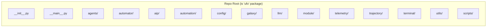
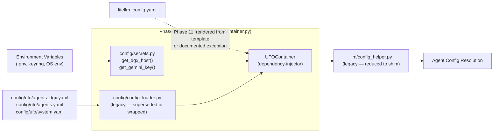
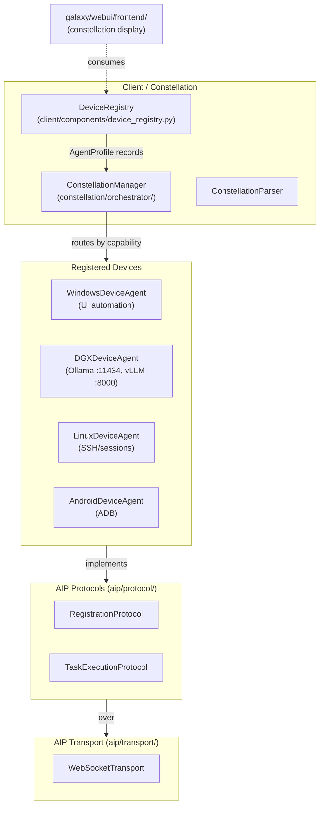
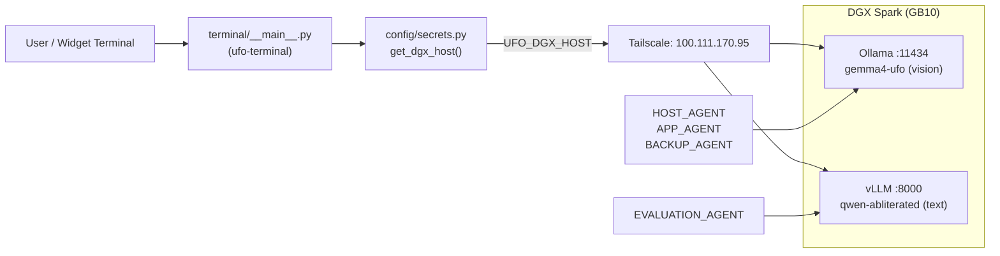
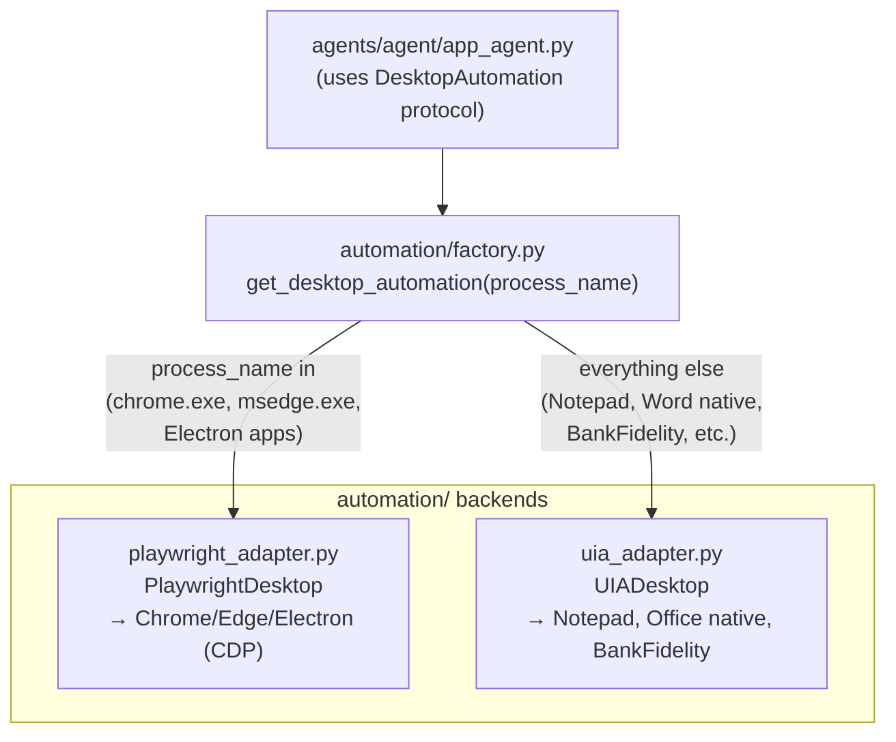
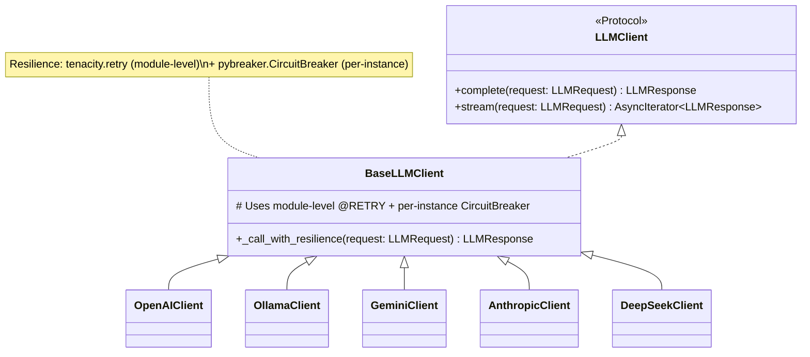
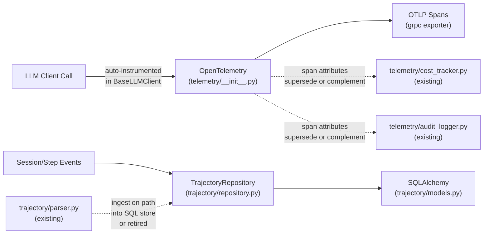
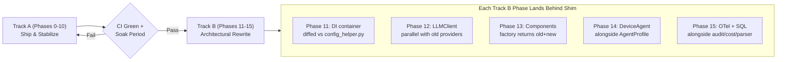

# Architecture (Auto-Generated by CI)

> **This file is generated by CI on every successful run.** Do not edit manually — changes will be overwritten.

## Package Layout (Corrected — No `ufo/` Double-Prefix)

**Import convention:** All internal imports use `ufo.X` (e.g., `from ufo.galaxy.client.device_manager import ...`). Filesystem paths have **no `ufo/` prefix**.

## Key Packages

| Package | Purpose | Status |
|---------|---------|--------|
| `agents/` | Agent implementations (61 files, inheritance hierarchy) | Existing |
| `automation/` | **NEW** — `DesktopAutomation` protocol + Playwright/UIA backends | Phase 2 |
| `config/` | Config loading + DI container + secrets | Existing + Phase 4/11 |
| `galaxy/` | Multi-device constellation, web UI, device agents | Existing + Phase 8/14 |
| `llm/` | LLM providers, endpoint detection, **NEW** `LLMClient` protocol | Existing + Phase 12 |
| `module/` | Session pool, dispatcher, platform sessions | Existing |
| `terminal/` | **NEW** — modular widget terminal (split from `scripts/`) | Phase 3/7 |
| `telemetry/` | Audit logger, cost tracker, **NEW** OpenTelemetry bootstrap | Existing + Phase 15 |
| `trajectory/` | Parser, **NEW** SQLAlchemy models/repository | Existing + Phase 15 |

## Config Flow (Phase 1 + 11)

## Galaxy Orchestration (Phase 8 + 14)

## DGX Network Path (Corrected)

## Windows Automation Hybrid (Phase 2)

## LLM Client Protocol (Phase 12)

## Observability & Trajectory (Phase 15)

## Phase Gate (Track A → Track B)

---

*Generated: 2026-09-18 by CI pipeline*  
*Diagrams reflect corrected architecture from `docs/plans/E2E_REMEDIATION_PLAN.md`*