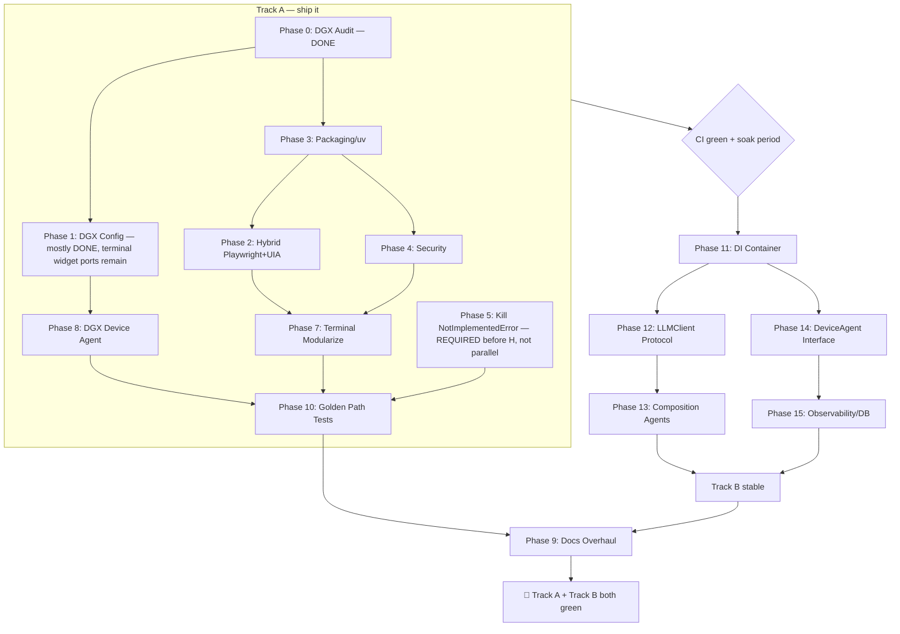

# UFO E2E Remediation Plan (v2 — Corrected Against Live Codebase)

**Scope:** Windows ARM64 + DGX Spark (GB10) + Galaxy Multi-Device + Architectural Modernization
**Status of this revision:** The original draft was written against a *stale* or *aspirational* picture of the repo. This version was checked line-by-line against the actual code at `C:\Users\lnxzf\Desktop\projects\ufo\ufo` (commit `26dea6a`) and corrected. Every correction below is backed by a file/line citation, not a guess.

> **If you only read one section, read "Corrections Applied" and "Phase 2 Rewritten."** Phase 2 as originally drafted is technically unworkable for its primary target (native Win32 apps), and several other phases target files/methods that don't exist or have already been fixed by recent commits.

---

## 🛠️ CORRECTIONS APPLIED TO THE ORIGINAL DRAFT

These are substantive, verified errors in the original plan — not style edits. Each one changes what work actually needs to happen.

### 1. Critical structural bug: the `ufo/` path prefix is wrong almost everywhere

The original plan writes new-file paths like `ufo/automation/desktop.py`, `ufo/terminal/__main__.py`, `ufo/config/container.py`, `ufo/llm/client.py`, `ufo/agent/core.py`, `ufo/galaxy/device_agent.py`, `ufo/trajectory/models.py`, `ufo/telemetry/__init__.py`.

**This repo's root directory *is* the `ufo` package already.** Proof:
- Repo root has `__init__.py` and `__main__.py`.
- Internal code already imports its own siblings as `ufo.X`: e.g. `galaxy/constellation/task_star.py:13` → `from ufo.galaxy.client.device_manager import ConstellationDeviceManager`; `galaxy/webui/dependencies.py:17,20`; `galaxy/constellation/parsers/constellation_parser.py:14`; a dozen more.
- Top-level dirs `galaxy/`, `aip/`, `llm/`, `agents/`, `module/`, `automator/`, `trajectory/`, `telemetry/`, `utils/`, `config/` already sit **directly under repo root**, not under a nested `ufo/` folder.

So "`ufo/automation/desktop.py`" as a *filesystem path* must actually be `automation/desktop.py` (repo-root-relative) — which Python code then imports as `ufo.automation.desktop`. If someone follows the original draft literally, they create `<repo_root>/ufo/automation/...`, i.e. a package nested two-deep (`ufo.ufo.automation`), breaking every existing `from ufo.X import Y` in the codebase and the `ufo-terminal` console-script entry point.

Interestingly, **Phase 8 of the original draft got this right by accident** — it places the new `DGXDeviceAgent` at `galaxy/device_agents/dgx_device_agent.py` (no `ufo/` prefix) and imports it via `ufo.galaxy...` / `ufo.aip...` (correct, since `galaxy` and `aip` are real root-level packages). That internal inconsistency is itself proof the other phases' paths are wrong.

**Fix applied throughout this revision:** every new-file path below has the redundant `ufo/` prefix removed. Import statements keep the `ufo.` prefix (that part was fine).

**One more consequence:** Phase 13 of the original draft proposed a *new* package called `ufo/agent/` (singular) for composition-based agents. After removing the bad prefix that becomes `agent/` (singular) at repo root — dangerously easy to confuse with the **existing** `agents/` (plural) package that already has 61 files and the current inheritance hierarchy. This revision keeps the new composition code inside the existing `agents/` package instead of creating a same-sounding sibling.

### 2. Phase 2 (Playwright) is built on a technical misconception

The original draft's migration-order table says:

> Notepad — Priority 1 — "Simplest Win32; Playwright CDP works"

**This is false.** Playwright automates browser engines (Chromium/Firefox/WebKit) via the Chrome DevTools Protocol, and — as an extension of that — Electron apps that embed Chromium. It has **no mechanism to attach to or drive an arbitrary native Win32 application** like Notepad, Word/Excel's native UI, or the Rust "BankFidelity" binary. There is no CDP endpoint on those processes for Playwright to connect to. This isn't a configuration detail — it's the architecture of the tool.

What *is* true from the original table:
- Chrome/Edge — correct, real CDP target, Playwright is a strict improvement here.
- Office (Word/Excel) — only true for anything served through a webview; the native ribbon/UI surface is UIA-only, same as today.
- BankFidelity (Rust, native) — no CDP surface; UIA/pywinauto (or raw Win32 API) is the only option.

**Revised Phase 2 approach** (see full rewrite below): keep `pywinauto`/`uiautomation` as the primary backend for native Win32 apps behind the new `DesktopAutomation` protocol, and add Playwright **only** as the backend for Chromium/Edge/Electron targets. The protocol/factory design from the original draft is still good — it's the backend assignment that was wrong. This is not a nit: it changes the phase's target from "5/10 → 9/10 via replacement" to "5/10 → 9/10 via a hybrid backend router," which is a smaller, safer, more honest scope.

**Blast-radius correction:** the original draft's "Files to Update" table for Phase 2 lists only `app_agent.py`, `controller.py`, `utils/__init__.py`, `system.yaml`. A repo-wide check shows **16 files** import `pywinauto`/`uiautomation` directly (not 2-3). Budget the phase accordingly.

### 3. Phase 0/1 facts are stale — some of this work is already done, some of it is *not* where the draft says

Checked against the live files:

| Claim in original draft | Reality | Action |
|---|---|---|
| `config/ufo/agents_dgx.yaml` still has HOST/APP/BACKUP pointed at `:8080`/`:8081` and needs rewriting | **Already fixed.** HOST_AGENT/APP_AGENT/BACKUP_AGENT are already on `API_TYPE: ollama`, `API_BASE: http://${UFO_DGX_HOST}:11434`, `API_MODEL: gemma4-ufo`; EVALUATION_AGENT is already on `http://${UFO_DGX_HOST}:8000/v1`, `qwen-abliterated`. | **Remove this item from Phase 1.** Nothing to do. |
| `llm/endpoint.py` lines 39-46 need `:11434`, `:8000` added to `local_ids` | **Already present** — line 39: `for local_id in ("127.0.0.1", "localhost", "0.0.0.0", ":4000", ":8080", ":8081", ":11434", ":8000", ":1234")`. | **Remove this item from Phase 1.** Nothing to do. |
| `litellm_config.yaml`: delete `ufo-dgx-model` (port 8080) and `ufo-dgx-app-model` (port 8081) | **Already correct** — `ufo-dgx-model` is on `:8000` (vLLM, `qwen-abliterated`), `ufo-dgx-app-model` is on `:11434` (Ollama, `gemma4-ufo`, `api_key: "ollama"`). The `:8080`/`:8081` entries in this file are `ufo-host-model`/`ufo-app-model` — the **local, non-DGX** llama-server profile — unrelated to the DGX cleanup. | **Remove the DGX part of this item.** The local-profile ports are a separate, legitimate concern only if llama-server is being decommissioned locally too — confirm intent before touching. |
| `scripts/terminal.py` / `scripts/terminal_config.py` still probe `:8080`/`:8081` for DGX | **Confirmed true and still broken.** `terminal_config.py:66-67` — `port_dgx_model: int = 8080`, `port_dgx_app_model: int = 8081`. `terminal.py:97` — `def check_dgx_host(dgx_host, port=8080)`; used at lines 239-240, 423-424, 495-496, 582, 609; menu labels at 550-551 still say `"Test via DGX Spark (network Qwen3-VL :8080)"` / `":8081"`. | **This is the real remaining Phase 1 work.** Keep it, it's accurately the highest-value fix left: rename/repoint `port_dgx_model`→ Ollama `11434`, `port_dgx_app_model` (rename to `port_dgx_vllm`) → `8000`, fix the menu label strings, fix `check_dgx_host`'s default. |

Net effect: **Phase 1 is much smaller than advertised.** Two of the three config files are done; the actual remaining surface is the terminal widget's hardcoded port defaults and menu text.

### 4. Phase 5's stub table has wrong method names/lines in two of the four files

Checked every citation against the live file:

- `agents/agent/basic.py` — **accurate as written.** `reflection()` at 240, `process()` at 265, `process_resume()` at 271, and the four retriever builders at 347/355/363/371. No changes needed to this row.
- `prompter/basic.py` — **wrong.** There is no `get_prompt_template()` method anywhere in this file. Line 217 is the `raise NotImplementedError` inside **`examples_prompt_helper()`** (def at line 212) — a method the original draft never mentions at all. Line 227 is inside `api_prompt_helper()` (def at line 222), not a separate "get_prompt_template." Corrected table:

  | Method | Line | Resolution |
  |---|---|---|
  | `examples_prompt_helper()` | def 212 / raise 217 | Not in original draft. Decide: no-op returning `""` (most subclasses don't need in-context examples) or `@abstractmethod` if every prompter subclass must supply one — check call sites first. |
  | `api_prompt_helper()` | def 222 / raise 227 | Verify call-site count before deciding "remove" vs "no-op returning `''`" — the original draft's "0 call sites, remove" claim was not independently re-verified here and should be re-checked with a fresh grep before acting. |

- `module/session_pool.py` — **wrong.** There is no method named `_create_session()`. What actually exists: `SessionFactory.create_session()` (line 97) with a `raise NotImplementedError` fallback branch around line 127 for an unrecognized session/platform type, plus **already-implemented** concrete methods `_create_windows_session()` (131), `_create_linux_session()` (197), `_create_mobile_session()` (243), and a second fallback `raise NotImplementedError` around line 336 (likely in `create_sessions_in_batch` or a related batch path). **The factory pattern the original draft asks for already exists.** The real, narrower task: handle the two fallback branches — decide whether an unrecognized session type should raise a clear `ValueError`/`UnsupportedPlatformError` (a real, documented failure) instead of a bare `NotImplementedError`, which is really all "eliminate NotImplementedError stubs" should mean here.
- `module/sessions/platform_session.py` — **mischaracterized.** The original draft claims the `NotImplementedError`s here are `_create_windows_session()`/`_create_linux_session()` platform gates and says "Keep — platform-specific" (i.e., do nothing). The actual stubs in this file are **`evaluation()`** and the markdown-log-saving method inside the **Linux** and **Mobile** session subclasses (`module/sessions/linux_session.py` around lines 78/87, `mobile_session.py` around lines 131/140 by the same pattern) — i.e., Linux and Mobile sessions cannot currently evaluate a completed task or persist a session log; Windows sessions presumably can. **This is a real functional gap, not something to leave alone** — and it directly threatens **Phase 10's DGX golden-path test**, since the DGX device is Linux: if that test's session ends by calling `evaluation()` or trying to save its trajectory log, it will hit this exact `NotImplementedError`. Move this from "no action" to a tracked Phase 5/10 dependency.

### 5. `pyproject.toml` — the Phase 3 rewrite conflicts with itself and with other phases

The live `pyproject.toml` today is **tool-config only** (`[tool.ruff]`, `[tool.mypy]`, `[tool.pytest.ini_options]`) — there is no `[project]`/`[build-system]` section, confirming the "1/10" packaging score. But the original draft's replacement introduces several new problems:

- It sets `[tool.mypy] strict = true` globally, effective **Week 1**. The same document's cleanup item C3 says mypy strict should be enabled "incrementally" module-by-module through Week 10, and the existing config today is explicitly `# Lenient mode — UFO has untyped third-party deps`. Turning on global strict mode in Phase 3 would fail CI's `lint` job immediately, long before Phases 2/7/11-15 have made the rest of the tree strict-clean. **Fix:** keep `strict = false` (or omit) at the top level in Phase 3; add `[[tool.mypy.overrides]]` blocks scoped to each new package (`automation.*`, `terminal.*`, etc.) as it's finished, per C3.
- It silently drops the current `addopts = "--ignore=tests/benchmark_harness.py --ignore=tests/load_test_harness.py"` down to just `--ignore=tests/benchmark_harness.py` (in the CI workflow) — `tests/load_test_harness.py` is no longer excluded anywhere. If that harness needs special hardware/timing like the benchmark one, this is a regression that will make ordinary `pytest`/CI runs pick it up. **Fix:** keep both ignores (in `pyproject.toml` and/or the CI job) unless load-test hardware is actually available in CI.
- The Phase 7.2 CLI snippet does `import typer`, but Phase 3.1's dependency list declares `click>=8.1`, not `typer`. Typer is a separate package (built on Click, but not the same import). **Fix:** either declare `typer>=0.15` explicitly and drop the bare `click` entry (Typer pulls Click transitively), or write Phase 7's CLI in Click. Don't leave an import with no matching dependency.
- Phase 12.4's resilience snippet uses `pybreaker.CircuitBreaker`, and Phase 15.1/15.2 use `opentelemetry.exporter.otlp.proto.grpc.trace_exporter.OTLPSpanExporter`, `opentelemetry.instrumentation.httpx.HTTPXClientInstrumentor`, and `AioHttpClientInstrumentor`. None of `pybreaker`, `opentelemetry-exporter-otlp-proto-grpc`, `opentelemetry-instrumentation-httpx`, or `opentelemetry-instrumentation-aiohttp-client` appear in the Phase 3.1 dependency list (only `opentelemetry-api`/`opentelemetry-sdk` are listed). **Fix:** add all four to `core` (or a new `observability` extra) before Phase 12/15 code is written, or the imports fail at runtime.

### 6. Phase 12.4's example code doesn't run

```python
class BaseLLMClient:
    def __init__(self, max_retries: int = 3, timeout: float = 120.0):
        self._retry = tenacity.retry(...)
        self._breaker = CircuitBreaker(fail_max=5, reset_timeout=60)

    @self._retry
    @self._breaker
    async def _call_with_resilience(self, request: LLMRequest) -> LLMResponse:
        pass
```

`@self._retry`/`@self._breaker` reference `self`, which does not exist at class-body evaluation time, and a `def` cannot be decorated by an expression computed inside a *different* method (`__init__`) at class-definition time regardless. This snippet raises `NameError` (or is simply a syntax/semantics error depending on how it's transcribed) the moment the module is imported. **Corrected pattern** — build the retry/breaker as module-level (or class-level, computed once) decorators and apply them normally:

```python
_RETRY = tenacity.retry(
    stop=tenacity.stop_after_attempt(3),
    wait=tenacity.wait_exponential(multiplier=1, min=2, max=30),
    retry=tenacity.retry_if_exception_type((httpx.RequestError, httpx.HTTPStatusError)),
)

class BaseLLMClient:
    def __init__(self, max_retries: int = 3, timeout: float = 120.0):
        self._breaker = CircuitBreaker(fail_max=5, reset_timeout=60)

    @_RETRY
    async def _call_with_resilience(self, request: LLMRequest) -> LLMResponse:
        return await self._breaker.call_async(self._do_call, request)
```
(Per-instance `max_retries`/`timeout` configurability, if actually needed, requires a factory that builds a bound retry decorator per instance — don't discover that requirement mid-implementation.)

### 7. New modules would silently collide with packages that already exist and already do related work

The original draft never checks for pre-existing code before proposing "new" packages:

- `config/` **already exists** as a real Python package: `config/__init__.py`, `config/config_loader.py`, `config/config_schemas.py`, plus `config/galaxy/` and `config/ufo/` data dirs. Phase 11's `container.py`/`secrets.py`/`settings.py` need to be added *into* this package and explicitly reconcile with (or replace) `config_loader.py`/`config_schemas.py` — the plan currently doesn't mention either file.
- `trajectory/` **already exists**, with a 16KB `parser.py`. Phase 15's `models.py`/`repository.py` need to say how they relate to `parser.py` (does it become the ingestion path into the new SQLAlchemy store? Is it superseded?).
- `telemetry/` **already exists**, with `audit_logger.py` and `cost_tracker.py` (already doing cost/usage tracking — arguably overlapping with what Phase 15's OpenTelemetry spans are meant to capture). Phase 15's new `telemetry/__init__.py` (OpenTelemetry bootstrap) must not clobber the existing `__init__.py` exports, and should explain whether `cost_tracker.py` is superseded by span attributes or kept as a separate concern.
- `galaxy/client/components/device_registry.py` **already exists** with a working `AgentProfile`/`register_device()` model; `galaxy/` also already has a full constellation subsystem (orchestrator, parsers, editor, session observers) **and a React/TSX web UI** (`galaxy/webui/frontend/src/components/constellation/*.tsx`). Phase 14's new `DeviceAgent` ABC needs to state explicitly how it relates to the existing `AgentProfile` server-side record (they are not the same thing — one is the registry's bookkeeping record, the other would be the client-side implementation each physical device runs), and any protocol change should call out that the web UI is a real consumer that can break silently.

### 8. CI is 0/10, not 2/10 — and the self-hosted runners are a real, uncosted dependency

`.github/workflows/` does not exist in this repo at all (confirmed by direct glob — no matches). There is no CI today. That's a bigger gap than "2/10," and more importantly, Phase 6's plan to run jobs on `[self-hosted, windows, arm64]` and `[self-hosted, linux, dgx]` runners assumes those runners are already provisioned and permanently online (a Windows ARM64 box, and the DGX Spark itself, registered as GitHub Actions runners, reachable over Tailscale). **Nothing in the plan allocates time to actually do that provisioning**, and it's the kind of task (network/firewall, systemd service, token rotation, keeping a personal DGX box online for CI) that regularly eats a week by itself. Add it as an explicit, time-boxed task in Phase 6, or descope the DGX/Windows CI jobs to "manual/nightly, run by a human" until the runners exist.

### 9. Stray sensitive-ish files at repo root should be handled in Phase 4, not ignored

`dgx_audit.json` and `pr_diff_review.txt` are sitting untracked at the repo root right now. `dgx_audit.json` contains the DGX's Tailscale IP, internal process listings (`ps aux` output with PIDs/usernames), and `nvidia-smi` output — exactly the kind of "internal infra fingerprint" Phase 4 (Security & Secrets Hardening) should be worried about. The plan's security phase never mentions either file. **Fix:** add both to `.gitignore` (or move `dgx_audit.json`'s content into a doc, sans raw process/host details) before anyone runs `git add -A` on this repo.

### 10. The Tailscale IP is hardcoded in a second place the plan never revisits

`litellm_config.yaml` hardcodes `100.111.170.95` twice (`ufo-dgx-model`, `ufo-dgx-app-model`), with a code comment explicitly noting *why*: LiteLLM's `os.environ/VAR` substitution replaces a whole field, so it can't be interpolated into the middle of a URL the way UFO's own YAML loader can for `agents_dgx.yaml`. Phase 11 (DI Container) does not mention `litellm_config.yaml` at all going forward — meaning after Phase 11 ships, there will still be exactly one hardcoded, out-of-band copy of the DGX address that the new `get_dgx_host()`/DI-driven config has no authority over. Either bring LiteLLM config generation under the same secrets/settings module (e.g. render `litellm_config.yaml` from a template at startup) or explicitly document it as an accepted exception.

### 11. Scoring and timeline realism

- The `X/10` scoring table and "38/100 → 100/100" framing is not a measurement of anything — there's no rubric behind it, so it can't regress or be checked. Keep the per-phase **checklists** (those are genuinely falsifiable — "does the test pass," "does the grep return 0") and drop the numeric score theater, or clearly label it as a vibes-based tracking aid, not an acceptance criterion.
- Phases 11-15 (DI container, unified LLM protocol, composition-based agents, new `DeviceAgent` interface, OpenTelemetry + SQLAlchemy trajectory store) are a from-scratch architectural rewrite of the config system, every LLM call path, the entire agent class hierarchy (with `agents/` having **61 files** and at least 6 direct external references to the concrete `AppAgent`/`HostAgent`/`EvaluationAgent` classes today), and the device/galaxy protocol — layered on top of, and in the *same* 10-week estimate as, Phases 0-10 ("make it work"). That is aggressive for any team size and turns "make it work" into a moving target while the ground underneath it is also being rewritten. **Recommendation:** treat Phases 0-10 as Track A (ship, stabilize, keep in production) and Phases 11-15 as Track B, explicitly gated on Track A being green in CI for some soak period, with each of 11-15 landing behind a flag/shim that runs old-and-new in parallel (e.g., the new DI container's config resolution diffed against `config_helper.py`'s output for a period) rather than a flag-day cutover. Add a one-line rollback note to every phase's verification checklist ("if this fails in prod, revert by ___").

---

## 🎯 EXECUTIVE SUMMARY (CORRECTED)

| Phase | Focus | Corrected Status | Key Deliverable |
|-------|-------|---------|-----------------|
| **0** | DGX Reality Audit | ✅ **COMPLETE** — verified against `dgx_audit.json` | Ollama `:11434` + vLLM `:8000` confirmed live on the GB10 box |
| **1** | DGX Config & Probes | **Mostly done.** `agents_dgx.yaml` and `litellm_config.yaml`'s DGX entries already correct. Remaining: `scripts/terminal.py` + `scripts/terminal_config.py` still hardcode `:8080`/`:8081` for DGX checks and menu text. | `health_check()` and the widget's menu labels match reality |
| **2** | Windows Automation — **Hybrid**, not full Playwright replacement | Rescoped. Playwright only covers Chromium/Edge/Electron; native Win32 (Notepad, Office native UI, BankFidelity) stays on UIA/pywinauto behind the same protocol. 16 files import these libraries today, not ~3. | `DesktopAutomation` protocol with two real backends, routed per-target |
| **3** | Packaging & Dependency Hygiene (uv) | Diagnosis (1/10, tool-config-only `pyproject.toml`) confirmed accurate. Fix the strict-mypy-too-early, missing-deps, and load-test-ignore regressions noted above. | `pyproject.toml` + `uv.lock` + console scripts, without breaking CI on day 1 |
| **4** | Security & Secrets Hardening | Confirmed: `'Machine'`-scope `SetEnvironmentVariable` at `terminal.py:413,539`; HKLM registry read at `502`,`970`; GEMINI key in URL. Add: gitignore `dgx_audit.json`/`pr_diff_review.txt`; reconcile the hardcoded Tailscale IP in `litellm_config.yaml`. | User-scope env, keyring, no admin, no leaked infra fingerprints |
| **5** | Eliminate `NotImplementedError` Stubs | Table corrected for `prompter/basic.py`, `module/session_pool.py`, `module/sessions/*.py` (see corrections #4 above). `agents/agent/basic.py` table was already accurate. | Zero *unintentional* stubs; Linux/Mobile session `evaluation()`/log-save actually implemented |
| **6** | CI/CD | **0/10** (no `.github/workflows/` exists), not 2/10. Runner provisioning called out as its own task. | Lint + unit green first; windows/DGX jobs added once runners exist |
| **7** | Terminal Widget Modularization | Unchanged in substance; `scripts/terminal.py` is 1,188 lines today (not 53K) — still worth splitting, just size the effort correctly. | `terminal/` package (no `ufo/` prefix), `--dry-run`, tests |
| **8** | Galaxy DGX Device Agent | Paths were already correct in the original draft (rare). Reconcile new `DGXDeviceAgent` naming with existing `AgentProfile`/`DeviceRegistry`. | `DGXDeviceAgent` registers, executes tasks, doesn't collide with existing registry model |
| **9** | Documentation Overhaul | Unchanged in substance. | Living, auto-generated docs |
| **10** | Golden Path E2E Tests | Now explicitly depends on Phase 5's Linux-session fix (see #4). | 3 golden paths passing in CI |
| **11** | DI Container for Config Resolution | Must explicitly absorb/replace `config/config_loader.py` + `config_schemas.py` (previously unmentioned), and take over `litellm_config.yaml` generation or document the exception. | Replace `llm/config_helper.py` (348 lines today) with `dependency-injector`, reconciled with existing `config/` package |
| **12** | Unified `LLMClient` Protocol | Fix the broken decorator snippet (#6); add missing deps (`pybreaker`, otel packages). | Collapse LLM files → 1 protocol + adapters |
| **13** | Composition-Based Agents | Build inside the existing `agents/` package, **not** a new sibling `agent/` (singular) package. 61 files and ≥6 direct external references to today's concrete classes — budget a real migration, not a cutover. | Components replace inheritance without a same-named collision |
| **14** | Explicit `DeviceAgent` Interface | Must state its relationship to the existing `galaxy/client/components/device_registry.py` `AgentProfile` model and the existing web UI. | Galaxy truly multi-device; DGX = first-class, without breaking the webui |
| **15** | Observability & DB Trajectory Store | Must reconcile with existing `telemetry/audit_logger.py`, `telemetry/cost_tracker.py`, `trajectory/parser.py` instead of ignoring them. | OpenTelemetry + SQLAlchemy trajectory store, integrated not duplicated |

> **Track A (ship it): Phases 0-10.** Most of the real, verified remaining work is here, and it's smaller than the original draft implied (Phase 1 mostly done; Phase 2 is a hybrid, not a rip-and-replace).
> **Track B (make it right): Phases 11-15.** Explicitly gated on Track A being stable in CI. Each phase should land behind a shim/parallel-run, not a cutover.

---

## 🔬 PHASE 0: DGX SPARK REALITY AUDIT — ✅ COMPLETE (verified)

Cross-checked against the live `dgx_audit.json` in the repo (captured 2026-09-18, `arch: aarch64`, Ubuntu 24.04.5 LTS):

| Component | Status | Details |
|-----------|--------|---------|
| **Ollama `:11434`** | ✅ Running | `gemma4-ufo:latest` (25.2B, Q4_K_M, 262K ctx, vision+tools+thinking), `gemma4:26b`, `qwen2.5-coder:32b` |
| **vLLM `:8000`** | ✅ Running | `qwen-abliterated` (`/models/Qwen3.6-35B-A3B-abliterated-NVFP4-MTP`, 131K ctx, FlashInfer attention, FP8 KV cache, MTP speculative decoding, `-tp 1`) |
| **llama-server `:8080`/`:8081`** | ❌ Not running | Confirmed by process list (`ollama serve` + `vllm serve` only); ~90GB VRAM already committed to the vLLM EngineCore |
| **Hardware** | ✅ GB10 | `NVIDIA GB10`, driver 580.178.04, CUDA 13.0, unified memory, aarch64 |

**Decision validated:** do not stand up llama-server on the DGX. Ollama (vision) + vLLM (text) only. This part of the original draft was accurate and needs no correction.

---

## 🏗️ PHASE 1: DGX CONFIG & PROBES (corrected — smaller than originally scoped)

### 1.1 What's actually left

| File | Lines | Change |
|------|-------|--------|
| `scripts/terminal_config.py` | 66-67 | Rename/repoint `port_dgx_model: int = 8080` → Ollama port `11434`; rename `port_dgx_app_model` → `port_dgx_vllm: int = 8000`. Keep both names discoverable via a short deprecation alias if `terminal.py` references the old attribute names elsewhere. |
| `scripts/terminal.py` | 97 | `def check_dgx_host(dgx_host, port: int = 8080)` → change default, and prefer explicit probes: `GET /api/tags` for Ollama, `GET /v1/models` for vLLM, rather than a bare TCP/HTTP-200 check. |
| `scripts/terminal.py` | 239-240, 423-424, 495-496, 582, 609 | All call sites of `check_dgx_host(dgx_host, cfg.port_dgx_model / port_dgx_app_model)` — update to the renamed attributes. |
| `scripts/terminal.py` | 550-551 | Menu label strings currently say `"Test via DGX Spark (network Qwen3-VL :8080)"` / `":8081"` — these are stale in *two* ways: wrong port, and wrong model name (DGX serves `gemma4-ufo` and `qwen-abliterated`, not "Qwen3-VL"). Fix the text, not just the port. |

### 1.2 Already done (no action)

- `config/ufo/agents_dgx.yaml` — HOST/APP/BACKUP on Ollama `:11434`/`gemma4-ufo`; EVALUATION_AGENT on vLLM `:8000`/`qwen-abliterated`. Verified correct as-is.
- `litellm_config.yaml`'s `ufo-dgx-model` (`:8000`) and `ufo-dgx-app-model` (`:11434`) entries — already correct. (Its `ufo-host-model`/`ufo-app-model` entries on `:8080`/`:8081` are the *local*, non-DGX profile and are out of scope for this phase — don't touch them here.)
- `llm/endpoint.py` `is_local_endpoint()` — already recognizes `:11434` and `:8000` (line 39) and the `sk-local` key convention.

### 1.3 Verification

- [ ] `health_check()` shows `DGX Ollama :11434 [PASS]`, `DGX vLLM :8000 [PASS]` using the *renamed* config attributes
- [ ] Menu text in `terminal.py` no longer says "Qwen3-VL :8080"/"​:8081"
- [ ] `resolve_agent_config("HOST")` (already correct today) still returns `API_BASE: http://100.111.170.95:11434` with no unresolved placeholders — this is a regression check, not new work
- [ ] Test completion via DGX returns tokens from `gemma4-ufo` (vision) and `qwen-abliterated` (text)

---

## 🏗️ PHASE 2: WINDOWS AUTOMATION — HYBRID PLAYWRIGHT + UIA (rewritten)

### 2.1 Why this phase is rescoped

Playwright drives Chromium/Firefox/WebKit via CDP, plus Electron apps that embed Chromium. It **cannot** attach to arbitrary native Win32 windows. Notepad, Office's native ribbon UI, and the Rust "BankFidelity" binary have no CDP surface — there is nothing for Playwright to connect to. Treat this phase as **adding a second backend**, not replacing the first.

### 2.2 Dependency change

```toml
[project.optional-dependencies]
windows = ["playwright>=1.48"]              # Chromium/Edge/Electron targets only
legacy  = ["pywinauto>=0.6.9", "uiautomation>=2.0", "comtypes>=1.4", "pywin32>=312"]  # native Win32 — stays a hard dependency for this platform, not "legacy" in the sense of "going away"
```

(Renaming the `legacy` extra to something like `native-win32` would be clearer than implying it's being phased out — it isn't, for anything outside a Chromium surface.)

### 2.3 New files

```
automation/                      # NOTE: no "ufo/" prefix — see Correction #1. Imported as ufo.automation.*
├── __init__.py
├── desktop.py                   # DesktopAutomation protocol (unchanged from original draft — this part was fine)
├── playwright_adapter.py        # PlaywrightDesktop — Chromium/Edge/Electron only
├── uia_adapter.py                # UIADesktop — Notepad, Office native UI, BankFidelity, everything else
├── factory.py                    # get_desktop_automation(target) -> selects backend BY TARGET, not by global config flag
└── tests/
    └── test_playwright_adapter.py
    └── test_uia_adapter.py
```

The `DesktopAutomation` protocol from the original draft is reusable as-is:

```python
class DesktopAutomation(Protocol):
    async def launch(self, app: str, args: list[str] = None) -> int: ...
    async def find_window(self, title_re: str, class_name: str = None) -> Element: ...
    async def find_element(self, window: Element, **criteria) -> Element: ...
    async def click(self, element: Element): ...
    async def type_text(self, element: Element, text: str): ...
    async def get_text(self, element: Element) -> str: ...
    async def screenshot(self, region: Rect = None) -> bytes: ...
    async def close(self): ...
```

`factory.py` should route by **process/target type**, e.g.:

```python
def get_desktop_automation(process_name: str) -> DesktopAutomation:
    if process_name.lower() in ("chrome.exe", "msedge.exe") or is_electron_app(process_name):
        return PlaywrightDesktop()
    return UIADesktop()
```

### 2.4 Migration order (corrected)

| App | Backend | Notes |
|-----|---------|-------|
| Chrome/Edge | Playwright (CDP) | Real win here — best reliability, native to the tool |
| Electron apps (if any in scope) | Playwright (CDP) | Same CDP surface as Chrome |
| Notepad | UIA (`uia_adapter.py`) | No CDP surface exists; this was mislabeled as a Playwright target in the original draft |
| Word/Excel native UI | UIA, with an **optional** Playwright path only if/when Office's WebView2-based surfaces (e.g., some ribbon add-ins) are explicitly in scope | Don't assume; verify per surface |
| BankFidelity (Rust, native) | UIA / raw Win32, hybrid with subprocess for the binary as originally noted | Unchanged from original draft — this row was already correct |

### 2.5 Files to update — corrected blast radius

The original draft's table (`app_agent.py`, `controller.py`, `utils/__init__.py`, `system.yaml`) undercounts the surface. A repo-wide check for `import pywinauto`/`import uiautomation`/`from pywinauto`/`from uiautomation` returns **16 files**. Enumerate them explicitly before starting (`git grep -l` for those import patterns) and route each through `get_desktop_automation()` rather than assuming 4 files cover it.

### 2.6 Verification

- [ ] `pytest automation/tests/` passes on Windows ARM64, for **both** adapters
- [ ] Notepad task (UIA path): open → type "hello" → save → verify file content
- [ ] Chrome task (Playwright path): navigate → screenshot → extract text
- [ ] All 16 files that import `pywinauto`/`uiautomation` today either (a) go through the new protocol, or (b) are explicitly listed as out-of-scope with a reason
- [ ] `mypy` clean for `automation/` (module-scoped strict override, not a global flag — see Correction #5)

---

## 🏗️ PHASE 3: PACKAGING & DEPENDENCY HYGIENE — uv + pyproject.toml (corrected)

### 3.1 `pyproject.toml` — corrected version

Key differences from the original draft, per Corrections #5/#6 above: `strict` mypy is **not** flipped globally; `typer` is declared explicitly (or the CLI is written in `click`, matching what's declared); `pybreaker` and the OpenTelemetry exporter/instrumentation packages are added since later phases' code imports them; the existing `--ignore=tests/load_test_harness.py` is preserved.

```toml
[build-system]
requires = ["setuptools>=80", "wheel"]
build-backend = "setuptools.build_meta"

[project]
name = "ufo"
version = "3.0.0"
description = "UFO3: Multi-Device Agent Galaxy (Windows + DGX Spark)"
readme = "README.md"
license = {text = "MIT"}
requires-python = ">=3.10"
authors = [{name = "Microsoft", email = "ufo@microsoft.com"}]

[project.optional-dependencies]
core = [
    "aiohttp>=3.10", "aiohappyeyeballs>=2.7", "anyio>=4.0",
    "pydantic>=2.10", "pydantic-settings>=2.10", "PyYAML>=6.0",
    "rich>=13.0", "typer>=0.15",                       # was "click" in the original draft; Phase 7 code uses typer
    "colorama>=0.4", "websockets>=12.0", "httpx>=0.28",
    "tenacity>=9.0", "pybreaker>=1.2",                 # pybreaker added — Phase 12 imports it
    "python-dotenv>=1.0", "keyring>=25.0",
    "dependency-injector>=4.45",                        # Phase 11
    "structlog>=25.0",
    "opentelemetry-api>=1.28", "opentelemetry-sdk>=1.28",
    "opentelemetry-exporter-otlp-proto-grpc>=1.28",      # added — Phase 15 imports it
    "opentelemetry-instrumentation-httpx>=0.49",         # added — Phase 15 imports it
    "opentelemetry-instrumentation-aiohttp-client>=0.49",# added — Phase 15 imports it
    "sqlalchemy>=2.0", "alembic>=1.13",                  # Phase 15
]
windows = ["playwright>=1.48"]
dgx     = ["ollama>=0.4", "openai>=1.0", "httpx>=0.28"]
galaxy  = ["fastapi>=0.115", "uvicorn>=0.32", "websockets>=12.0", "pydantic>=2.10", "pydantic-settings>=2.10"]
eval    = ["pytest>=9.0", "pytest-asyncio>=1.4", "pytest-cov>=6.0", "ruff>=0.16", "mypy>=1.10", "hypothesis>=6.100"]
native-win32 = ["pywinauto>=0.6.9", "uiautomation>=2.0", "comtypes>=1.4", "pywin32>=312"]  # renamed from "legacy" — still required on Windows, see Phase 2
all = ["core", "windows", "native-win32", "dgx", "galaxy", "eval"]

[project.scripts]
ufo-terminal = "terminal.__main__:main"   # NOTE: "terminal", not "ufo.terminal" as a filesystem path — see Correction #1. Import path is ufo.terminal.__main__ once repo root is on sys.path as "ufo".
ufo-galaxy   = "galaxy.cli:main"
ufo          = "__main__:main"

[tool.ruff]
target-version = "py310"
line-length = 120
exclude = [".git", "__pycache__", "*.egg-info", "logs"]

[tool.ruff.lint]
select = ["E", "F", "I", "W", "UP", "B", "C4", "SIM"]
ignore = ["E501", "E402"]   # E402 stays ignored until the sys.path.insert() hacks (Cleanup C2) are actually removed

[tool.ruff.format]
quote-style = "double"
indent-style = "space"

[tool.mypy]
python_version = "3.10"
ignore_missing_imports = true
follow_imports = "silent"
warn_unused_ignores = true
no_strict_optional = true          # stays lenient at the top level; tighten per-module as each package is finished (Cleanup C3)
exclude = ["logs/", "scripts/legacy/"]

# Add one override block per package as it's cleaned up, e.g.:
# [[tool.mypy.overrides]]
# module = "automation.*"
# strict = true

[tool.pytest.ini_options]
testpaths = ["tests", "automation/tests", "terminal/tests"]
asyncio_mode = "auto"
addopts = "--ignore=tests/benchmark_harness.py --ignore=tests/load_test_harness.py -q"   # both ignores preserved from the current config
markers = [
    "requires_dgx: marks tests requiring DGX Spark hardware",
    "requires_windows: marks tests requiring Windows",
    "integration: marks integration tests",
]

[tool.coverage.run]
source = ["."]
omit = ["*/tests/*", "scripts/legacy/*"]

[tool.coverage.report]
exclude_lines = ["pragma: no cover", "def __repr__"]
fail_under = 60   # start realistic; the original draft's "80" is a Phase-15-era target, not a Week-1 one
```

### 3.2 Lockfile

```bash
cd C:\Users\lnxzf\Desktop\projects\ufo\ufo
uv lock
uv pip compile pyproject.toml --all-extras -o requirements-lock.txt
git add pyproject.toml uv.lock requirements-lock.txt
git rm requirements.txt requirements-dev.txt requirements-extra.txt requirements-models.txt
```

### 3.3 Move the terminal widget into a package (corrected paths, corrected size estimate)

`scripts/terminal.py` is **1,188 lines** today, not 53,000 — still worth splitting for testability, but size the effort as "a day or two of mechanical extraction," not a multi-week rewrite.

```
scripts/terminal.py          → terminal/__main__.py          # NOT ufo/terminal/ — see Correction #1
scripts/terminal_config.py   → terminal/config.py
scripts/advanced_settings.py → terminal/advanced.py
scripts/switch_backend.py    → terminal/backend.py
scripts/diagnostics.py       → terminal/diagnostics/probes.py   # NOTE: original draft says "scripts/diagnostics/" (a directory) — it's actually a single file, scripts/diagnostics.py, today. Confirm before assuming a directory move.
scripts/smoke_tests.py       → terminal/tests/test_smoke.py     # same correction: it's a file, not a directory, today
```

### 3.4 Verification

- [ ] `uv sync --all-extras` installs without conflicts
- [ ] `ufo-terminal --selftest` runs from a fresh venv
- [ ] `uv.lock` committed
- [ ] No `requirements*.txt` files remain
- [ ] CI's `lint` job passes on day 1 (i.e., mypy isn't strict-globally yet — see Correction #5)

---

## 🏗️ PHASE 4: SECURITY & SECRETS HARDENING (corrected line numbers, expanded scope)

### 4.1 Confirmed issues (verified against live `scripts/terminal.py`)

| Line(s) | Issue | Fix |
|------|-----|-----|
| 413, 539 | `SetEnvironmentVariable('UFO_DGX_HOST' / var_name, ..., 'Machine')` — requires Admin | `'User'` scope |
| 502, 970 | `reg query HKLM\...\Environment` for `GEMINI_API_KEY` | Remove; use `secrets.py` (below) |
| 499, 967 | `os.environ.get('GEMINI_API_KEY', '')` read pattern feeding into the HKLM fallback | Same fix, route through `get_secret()` |
| 213, 313, 459, 470, 1098, 1103 | `subprocess.run(['taskkill', '/IM'/'/PID', ...])` | Prefer `psutil.Process(pid).terminate()`; if `taskkill` stays, validate the PID is purely numeric (from `netstat` parsing) before interpolating it into the argv list |
| 316, 466 | `subprocess.run(['netstat', '-ano'], ...)` then parse PIDs | Parsing untrusted-looking output is fine since it's local `netstat`, but validate the parsed PID string is `str.isdigit()` before passing to `taskkill`/`terminate()` |

### 4.2 New scope: stray files (Correction #9)

- Add `dgx_audit.json` and `pr_diff_review.txt` to `.gitignore`, or scrub host/PID/IP details out of `dgx_audit.json` before it's ever committed. Check now — both are currently untracked, so this is a "before the next `git add`" fix, not a cleanup-later item.

### 4.3 New scope: reconcile the second hardcoded IP (Correction #10)

- Decide whether `litellm_config.yaml`'s two hardcoded `100.111.170.95` occurrences are rendered from the new secrets/settings module at deploy time, or explicitly documented as the one accepted exception (with a comment pointing at *why*, which the file already partially has).

### 4.4 `config/secrets.py` (corrected location — not `ufo/config/`)

```python
# config/secrets.py  (lives inside the EXISTING config/ package, alongside config_loader.py)
import os
from typing import Optional
import keyring
from dotenv import load_dotenv

load_dotenv()

def get_secret(service: str, key: str) -> Optional[str]:
    return (
        keyring.get_password(f"ufo/{service}", key)
        or os.getenv(key)
        or os.getenv(f"UFO_{service.upper()}_{key.upper()}")
    )

def set_secret(service: str, key: str, value: str) -> None:
    keyring.set_password(f"ufo/{service}", key, value)

def get_dgx_host() -> str:
    return get_secret("dgx", "host") or "100.111.170.95"

def get_gemini_key() -> Optional[str]:
    return get_secret("gemini", "api_key")
```

### 4.5 Verification

- [ ] No `subprocess.run([..., shell=True])` with unvalidated interpolated input (confirm none currently use `shell=True` — the ones found above pass argv lists, which is already safer than the original draft implied; the real fix is the PID validation, not shell-injection per se)
- [ ] `UFO_DGX_HOST` set via `'User'` scope or `.env`, no Admin required
- [ ] `GEMINI_API_KEY` never read from HKLM
- [ ] `dgx_audit.json` / `pr_diff_review.txt` gitignored or scrubbed
- [ ] `litellm_config.yaml`'s hardcoded IP reconciled or explicitly documented as an exception

---

## 🏗️ PHASE 5: ELIMINATE NOTIMPLEMENTEDERROR STUBS (corrected table)

| File | Method | Verified location | Resolution |
|------|--------|---|------------|
| `agents/agent/basic.py` | `reflection()` | 240 | Remove if truly 0 call sites (re-verify with a fresh grep — don't trust a stale count) |
| `agents/agent/basic.py` | `process()` | 265 | `@abstractmethod` |
| `agents/agent/basic.py` | `process_resume()` | 271 | No-op in `BasicAgent` + deprecation warning |
| `agents/agent/basic.py` | 4x retriever builders | 347/355/363/371 | No-op returning `None` |
| `prompter/basic.py` | `examples_prompt_helper()` | def 212 / raise 217 | **Not in the original draft.** Decide no-op vs abstract based on call sites; don't skip it |
| `prompter/basic.py` | `api_prompt_helper()` | def 222 / raise 227 | Re-verify call-site count (original draft's "0 call sites" was not independently re-confirmed here) before removing |
| `module/session_pool.py` | `SessionFactory.create_session()` fallback branch | ~127 | Already has a working factory (`_create_windows_session`/`_create_linux_session`/`_create_mobile_session` all exist) — just replace the bare `NotImplementedError` with a descriptive `UnsupportedPlatformError`/`ValueError` |
| `module/session_pool.py` | second fallback branch | ~336 | Same treatment |
| `module/sessions/linux_session.py` | `evaluation()` | ~78 | **Real implementation needed**, not "keep" — required for the DGX (Linux) golden-path test in Phase 10 |
| `module/sessions/linux_session.py` | log-save method | ~87 | Same |
| `module/sessions/mobile_session.py` | `evaluation()` | ~131 | Same treatment if mobile golden paths are in scope |
| `module/sessions/mobile_session.py` | log-save method | ~140 | Same |
| `module/basic.py` | `evaluation()` (abstract declaration) | ~296 | `@abstractmethod` — note a concrete override already exists around line 646; confirm it's the only one needed |
| `module/basic.py` | `create_following_round()` | ~414 | `@abstractmethod` |
| `module/dispatcher.py` | `execute_commands()` | ~21 (not 28) | Already has ≥2 concrete implementations (lines 64, 130) — likely just needs the `@abstractmethod` decorator added to the base declaration, not new implementations |
| `llm/placeholder.py` | (unspecified stub) | — | **Missing from the original draft entirely.** This file also contains a `NotImplementedError` per repo-wide grep — inventory it before declaring Phase 5 done |

### Verification

- [ ] `grep -rn "NotImplementedError" --include="*.py" .` (repo root) returns only intentional, documented `UnsupportedPlatformError`-style fallbacks — re-run this exact grep at the end, don't rely on the count above
- [ ] Linux/Mobile session `evaluation()` and log-save are implemented and covered by a unit test, since Phase 10's DGX golden path depends on it
- [ ] No test regressions

---

## 🏗️ PHASE 6: CI/CD (corrected baseline — 0/10, and runner provisioning is explicit work)

### 6.1 Baseline

`.github/workflows/` does not exist. There is currently **no CI at all** for this repo, not a partial one.

### 6.2 Workflow — same shape as the original draft, with the mypy/ignore fixes from Corrections #5 folded in, and DGX/Windows jobs marked as depending on runner provisioning that hasn't happened yet:

```yaml
name: CI
on: [push, pull_request]

jobs:
  lint:
    runs-on: ubuntu-latest
    steps:
      - uses: actions/checkout@v4
      - uses: astral-sh/setup-uv@v5
      - run: uv sync --all-extras
      - run: uv run ruff check .
      # mypy stays non-strict at repo scope until Cleanup C3 lands the per-module overrides
      - run: uv run mypy .

  unit-tests:
    runs-on: ubuntu-latest
    steps:
      - uses: actions/checkout@v4
      - uses: astral-sh/setup-uv@v5
      - run: uv sync --group core --group eval
      - run: uv run pytest -q --ignore=tests/integration --ignore=tests/benchmark_harness.py --ignore=tests/load_test_harness.py

  # The two jobs below require a Windows ARM64 box and the DGX Spark itself to be
  # registered as GitHub self-hosted runners. THAT PROVISIONING IS NOT DONE and is
  # not "free" — budget real time for it (network/Tailscale reachability, a
  # persistent service, token rotation). Until it exists, run these manually/nightly.
  windows-tests:
    runs-on: [self-hosted, windows, arm64]
    if: false   # flip to true only once the runner is actually registered
    steps:
      - uses: actions/checkout@v4
      - uses: astral-sh/setup-uv@v5
      - run: uv sync --group core --group windows --group native-win32 --group eval
      - run: uv run playwright install
      - run: uv run pytest -q automation/tests/

  dgx-integration:
    runs-on: [self-hosted, linux, dgx]
    if: false   # flip to true only once the runner is actually registered
    steps:
      - uses: actions/checkout@v4
      - uses: astral-sh/setup-uv@v5
      - run: uv sync --group core --group dgx --group galaxy --group eval
      - run: uv run pytest -q tests/e2e_golden_path_dgx.py tests/e2e_galaxy_constellation.py
```

(Dropped the original draft's `if: github.repository == 'ttfwap-lang/ufo'` hardcoded-fork check — that silently no-ops the job on any fork/rename and isn't needed if the job is already gated on `self-hosted` runner labels that only exist in one place.)

### 6.3 Verification

- [ ] `lint` + `unit-tests` green on `ubuntu-latest` — no self-hosted dependency, should be achievable immediately
- [ ] Windows ARM64 runner actually provisioned and registered (separate, explicit task) before flipping `windows-tests` on
- [ ] DGX runner actually provisioned and registered before flipping `dgx-integration` on

---

## 🏗️ PHASE 7: TERMINAL WIDGET MODULARIZATION (corrected paths/size)

Same structure as the original draft, with the path-prefix fix (Correction #1) and the size correction (1,188 lines, not 53K) applied:

```
terminal/                    # imported as ufo.terminal — no literal "ufo/" folder
├── __init__.py
├── __main__.py              # Typer CLI (see Correction #5 re: typer vs click)
├── config.py
├── menu.py
├── health.py
├── backend.py
├── diagnostics/
│   ├── __init__.py
│   └── probes.py
└── tests/
    ├── test_menu.py
    ├── test_health.py
    └── test_backend.py
```

`--dry-run`/`--selftest` flags as in the original draft are reasonable and unchanged.

### Verification

- [ ] `pytest terminal/tests/` passes with mocked subprocess/httpx
- [ ] `ufo-terminal --dry-run` exits 0, no side effects
- [ ] `ufo-terminal --selftest` exercises all menus without external deps

---

## 🏗️ PHASE 8: GALAXY DGX DEVICE AGENT (paths were already correct — reconcile naming)

The original draft's file placement here (`galaxy/device_agents/dgx_device_agent.py`, imports via `ufo.galaxy...`/`ufo.aip...`) is consistent with the real repo layout — this phase didn't need a path fix. What it does need:

- **Naming reconciliation with the existing `AgentProfile`/`DeviceRegistry` model** (`galaxy/client/components/device_registry.py`, `galaxy/client/components/types.py`). `DeviceRegistry.register_device()` already takes `device_id`, `server_url`, `os`, `capabilities`, `metadata`, `max_retries` and produces an `AgentProfile`. The new `DGXDeviceAgent.register()` should call into this existing registration path (or its Galaxy-server-side equivalent) rather than inventing a parallel concept — clarify in the phase write-up that `AgentProfile` is the *server-side record* and `DGXDeviceAgent` is the *client-side process* that causes that record to exist, so implementers don't build two competing device models.
- The `aip.protocol.registration.RegistrationProtocol` / `aip.transport.websocket.WebSocketTransport` / `aip.protocol.task_execution.TaskExecutionProtocol` classes referenced in the original draft's snippet **do exist** in the repo (`aip/protocol/registration.py`, `aip/transport/websocket.py`, `aip/protocol/task_execution.py`) — confirm their actual method signatures before copy-pasting the snippet; the original draft's `register_as_device(...)` call signature was not verified against the live `RegistrationProtocol` class and may not match exactly.

Everything else in the original draft's Phase 8 (device registry auto-discovery, constellation routing, `config/galaxy/devices.yaml`) is architecturally reasonable and unchanged.

### Verification

- [ ] `DGXDeviceAgent` registers and produces exactly one `AgentProfile` server-side (not a duplicate record)
- [ ] Constellation task with `device_type: DGX_SPARK` routes to the DGX agent
- [ ] Multi-device task (Windows UI + DGX LLM) completes E2E

---

## 🏗️ PHASE 9: DOCUMENTATION OVERHAUL (unchanged in substance)

Replace `E2E_VERIFICATION_REPORT.md`, `TEST_READY.md`, `PROJECT.md` (all confirmed to exist at repo root today) with CI-generated `docs/status.md` / `docs/testing.md` / `docs/architecture.md`. No factual corrections needed here beyond noting all three source files are real and currently hand-maintained.

### Verification

- [ ] `docs/status.md` auto-updated by CI
- [ ] `docs/architecture.md` has real Mermaid diagrams matching the corrected package layout (no `ufo/` double-prefix in any diagram)
- [ ] No aspirational "100% complete" claims remain anywhere in the repo's docs

---

## 🏗️ PHASE 10: GOLDEN PATH E2E TESTS (unchanged shape, new explicit dependency)

Same three tests as the original draft (`tests/e2e_golden_path_local.py`, `tests/e2e_golden_path_dgx.py`, `tests/e2e_galaxy_constellation.py`), with one addition: **`test_dgx_golden_path` now has an explicit, previously-hidden dependency on Phase 5's Linux-session fix** (Correction #4) — the DGX device is Linux, so any session-completion path that calls `evaluation()` or saves a trajectory log will hit `module/sessions/linux_session.py`'s current `NotImplementedError` unless Phase 5 has landed first. Sequence Phase 5 before Phase 10, not in parallel.

---

## 🏗️ PHASE 11: DI CONTAINER FOR CONFIG RESOLUTION (corrected location + scope)

`llm/config_helper.py` (348 lines today, confirmed) is the real target. The new container code goes inside the **existing** `config/` package (which already has `config_loader.py` + `config_schemas.py`), not a new `ufo/config/` folder:

```
config/
├── __init__.py
├── config_loader.py     # EXISTING — container.py must state whether this is superseded or wrapped
├── config_schemas.py    # EXISTING — same
├── container.py         # NEW
└── secrets.py           # NEW (Phase 4)
```

Before writing `container.py`, read `config_loader.py`/`config_schemas.py` and decide explicitly: does the DI container replace them, call them, or sit beside them? The original draft never asks this question because it didn't know they existed.

The container sketch from the original draft (`UFOContainer`, `providers.Selector` keyed on backend mode, per-agent `Factory` providers) is architecturally reasonable and can be kept — just built inside `config/`, and with `litellm_config.yaml` generation brought under the same roof per Correction #10, or explicitly excluded with a comment explaining why.

### Verification

- [ ] `llm/config_helper.py` deleted or reduced to a thin compatibility shim
- [ ] Relationship to `config_loader.py`/`config_schemas.py` is explicit (replaced, wrapped, or coexisting — pick one and document it)
- [ ] Tests can override providers for isolated unit tests
- [ ] `litellm_config.yaml`'s hardcoded IP is either generated by this container or documented as the one accepted exception

---

## 🏗️ PHASE 12: UNIFIED `LLMClient` PROTOCOL (corrected snippet + deps)

Same protocol/adapter design as the original draft. Two fixes required before this phase is implementable:

1. **The resilience base-class snippet is broken** — see Correction #6 for the corrected version (module-level `tenacity.retry` decorator, not `@self._retry` sourced from inside `__init__`).
2. **`pybreaker` must be added to dependencies** (Correction #5) or the import fails.

File collapse table from the original draft (9 files → protocol + adapters) is reasonable; `llm/placeholder.py` (Correction #5's last row) should be added to the inventory since it also currently raises `NotImplementedError` and isn't mentioned in the original draft's collapse table.

### Verification

- [ ] All LLM calls go through the `LLMClient` protocol
- [ ] The corrected resilience base class actually imports and runs (write a one-line smoke test: instantiate `BaseLLMClient`, call `_call_with_resilience` against a mock)
- [ ] `llm/placeholder.py` accounted for, not silently dropped

---

## 🏗️ PHASE 13: COMPOSITION-BASED AGENTS (corrected package name + blast radius)

Build the new `AgentComponents`/`Agent`/factory code **inside the existing `agents/` package** (e.g. `agents/components.py`, `agents/core.py`, `agents/factory.py`) — **not** a new sibling package literally named `agent/` (singular). After the Correction #1 path fix, "`ufo/agent/`" from the original draft would become `agent/` at repo root, one letter away from the real, 61-file `agents/` package that already exists. That's a self-inflicted footgun; don't create it.

Confirmed blast radius: 6 files outside `agents/` itself directly reference the concrete `AppAgent`/`HostAgent`/`EvaluationAgent` classes today. Enumerate them (`git grep`) before starting and treat each as a required call-site migration, not an afterthought discovered mid-refactor.

### Verification

- [ ] New composition code lives under `agents/`, no new same-sounding top-level package created
- [ ] All 6+ external references to the concrete classes migrated, verified by grep returning 0 remaining direct instantiations outside the factory

---

## 🏗️ PHASE 14: EXPLICIT `DeviceAgent` INTERFACE (corrected — reconcile with existing model + webui)

Place the new ABC at `galaxy/device_agent.py` (no `ufo/` prefix — Correction #1; this matches how Phase 8 already got it right). Before writing it:

- Confirm how it relates to the **existing** `AgentProfile` record in `galaxy/client/components/device_registry.py` (Correction #7) — don't ship two parallel "what is a device" models.
- Note that `galaxy/webui/frontend/src/components/constellation/*.tsx` is a real consumer of today's device/constellation data shapes. Any change to what a "device" or "capability" looks like on the wire needs a corresponding webui check, which the original draft never mentions because it apparently didn't know the webui existed.

### Verification

- [ ] All device agents implement the new `DeviceAgent` protocol
- [ ] Relationship to `AgentProfile` documented and non-duplicative
- [ ] Webui's constellation display still renders correctly after the protocol change (manual check at minimum, automated if a webui test harness exists)

---

## 🏗️ PHASE 15: OBSERVABILITY & DATABASE TRAJECTORY (corrected — reconcile with existing telemetry/trajectory code)

Before writing `telemetry/__init__.py` (OpenTelemetry bootstrap) or `trajectory/models.py`/`repository.py` (SQLAlchemy), read what's already there:

- `telemetry/audit_logger.py` and `telemetry/cost_tracker.py` (both real, already doing usage/cost tracking) — decide whether OpenTelemetry span attributes supersede `cost_tracker.py`'s bookkeeping or complement it. Don't silently duplicate cost tracking in two systems.
- `trajectory/parser.py` (16KB, already parsing trajectory data in some existing format) — decide whether it becomes the ingestion path into the new SQLAlchemy store or is retired.
- Add the missing dependencies from Correction #5 (`opentelemetry-exporter-otlp-proto-grpc`, `opentelemetry-instrumentation-httpx`, `opentelemetry-instrumentation-aiohttp-client`) before the code in this phase can run.

Otherwise, the SQLAlchemy schema (`Session`/`Step` models) and repository pattern from the original draft are reasonable and unchanged.

### Verification

- [ ] All LLM calls emit OpenTelemetry spans
- [ ] Relationship to `audit_logger.py`/`cost_tracker.py` explicit (superseded, wrapped, or coexisting)
- [ ] Relationship to `trajectory/parser.py` explicit
- [ ] Queries work: "failed sessions last week," "avg tokens by backend"

---

## 🧹 CLEANUP PHASES (interleaved, mostly unchanged)

- **C1 — Remove dead code:** `git rm -r scripts/_archive scripts/legacy_patches` if these still exist — re-verify with `ls` first, don't assume the original draft's inventory is current given how much else in it was stale.
- **C2 — Remove `sys.path.insert()` hacks:** confirmed relevant — `[tool.ruff.lint] ignore = ["E402"]` exists specifically because of this pattern today. Removing the hack is also what lets Phase 3's ruff config eventually drop the `E402` ignore.
- **C3 — Enable strict mypy incrementally:** this is now the *only* place strict mypy gets turned on (Correction #5 removed the premature global flip in Phase 3). Start with `automation.*`, `terminal.*`, `config.*` as they're finished.
- **C4 — Replace custom resilience with `tenacity` + `pybreaker`:** unchanged, but see Correction #6 for the actual working pattern.
- **C5 — Contract tests for config:** unchanged; a `hypothesis`-based test that no resolved config ever contains an unexpanded `${VAR}` is a good, cheap regression guard, especially given Phase 1 found the config files are *mostly* already correct — this test would have caught the terminal-widget drift automatically.

---

## 🚀 EXECUTION ORDER (corrected dependency graph)



**Critical path (Track A):** Phase 0 → 1 → 3 → (2/4/8 in parallel) → **5 (required, not optional, before 10)** → 7 → 10 → 9
**Track B** starts only after Track A has been green in CI for a defined soak period, and each of Phases 11-15 should land behind a shim/parallel-run rather than a cutover (see Correction #11).

---

## ✅ MASTER VERIFICATION CHECKLIST (Track A — the part that's actually load-bearing)

- [ ] `scripts/terminal_config.py` / `scripts/terminal.py` DGX ports and menu text fixed (the real remaining Phase 1 work)
- [ ] `DesktopAutomation` protocol with **two** real backends (Playwright for CDP targets, UIA for everything else), all 16 `pywinauto`/`uiautomation`-importing files accounted for
- [ ] `pyproject.toml` + `uv.lock` committed; CI `lint`/`unit-tests` green on `ubuntu-latest` without a premature global mypy-strict flip
- [ ] `dgx_audit.json` / `pr_diff_review.txt` gitignored or scrubbed; no Admin-scope env vars; no HKLM reads
- [ ] `NotImplementedError` inventory re-verified by fresh grep; Linux/Mobile session `evaluation()`/log-save actually implemented (blocks the DGX golden path)
- [ ] `.github/workflows/ci.yml` exists and is green for the two jobs that don't need self-hosted runners; Windows/DGX runner provisioning tracked as its own explicit task, not assumed
- [ ] Three golden-path tests pass, in the corrected dependency order (Phase 5 before Phase 10)

Track B (Phases 11-15) gets its own checklist once Track A is stable — see each phase's "Verification" section above; the top-level "100/100" score from the original draft is deliberately not reproduced here since it isn't a falsifiable metric (see Correction #11).
